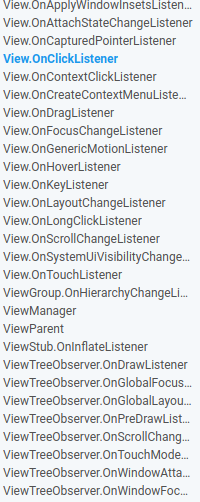

# Interaccion

---

Lo visto hasta ahora nos ha permitido definir interfaces de usuario para poder crear pantallas en las aplicaciones, pero, por el momento no ha existido interaccion entre las vistas en las actividades, es decir, aun no se ha hecho código para responder a eventos.

Para trabajar con los elementos de la pantalla desde el código, lo primero que hay que hacer es recuperar el objeto que los representa y existe un metodo para ello : ```findViewById(R.id.identificador_del_view)```. Este metodo busca en el layout mostrado el elemento que tenga como atributo ```id``` el que se le haya pasado como parametro y lo devuelve a modo de objeto. Si no encuentra ningún elemento con ese indicador, devolvera un nulo. 

Como se utiliza el mismo metodo para devolver cualquier tipo de **View** que esta definido en el layout, se debe realizar un ```cast``` a la clase correspondiente del objeto para poder acceder a los parametros o metodos que sean necesarios. Por ejemplo, si lo que se recupera es un elemento imagen, le podremos indicar que imagen tiene que mostrar, pero, si se recupera un elemento **TextView**, no se le puede dar una imagen como parametro.


---

Los **Listeners** se ejecutan cuando ocurre un evento. Eventos como ```click```, ```swipe```, ```long_click```, ```hover```, etc. Por ejemplo tenemos una interfaz llamada ```ActionListener```, esta llama al metodo ```actionPerformed()``` cuando el evento ocurre.

Esta es unos cuantos listeners de la clase **View** para la interaccion con el usuario.El más común [```OnClickListener```](https://developer.android.com/reference/android/view/View.OnClickListener.html)




# Lecturas
- [Android user interaction](https://code.tutsplus.com/tutorials/android-sdk-user-interaction--mobile-20342)
- [Implementing a onClickListener](http://blog.cubeactive.com/onclicklistener-android-tutorial/)
- [Creating custom listeners](https://guides.codepath.com/android/Creating-Custom-Listeners)
- [Best Practices for Interaction](https://developer.android.com/training/best-ux.html)
- [Tic Tac Toe Example](https://medium.com/wiselteach/tic-tac-toe-tablelayout-android-app-androidmonk-a56b9e1c6a15)

Si estas un poco mas interesado o enfocado en el desarrollo con **Kotlin** puedes revisar [Kotlin Android Extensions](https://kotlinlang.org/docs/tutorials/android-plugin.html).

